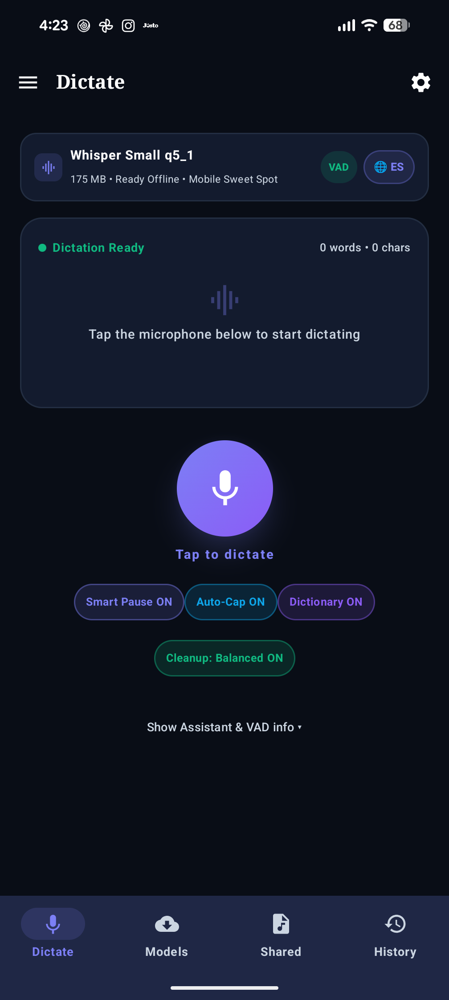
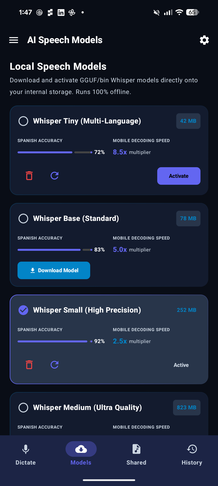
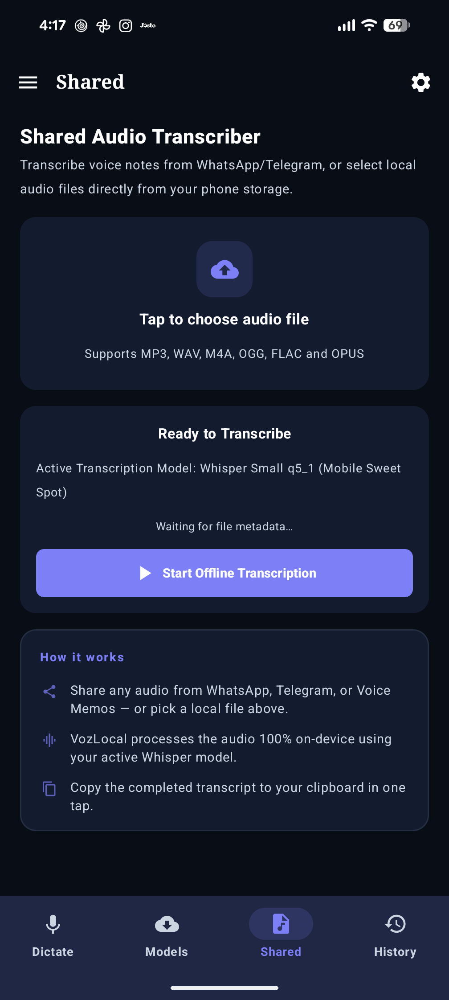
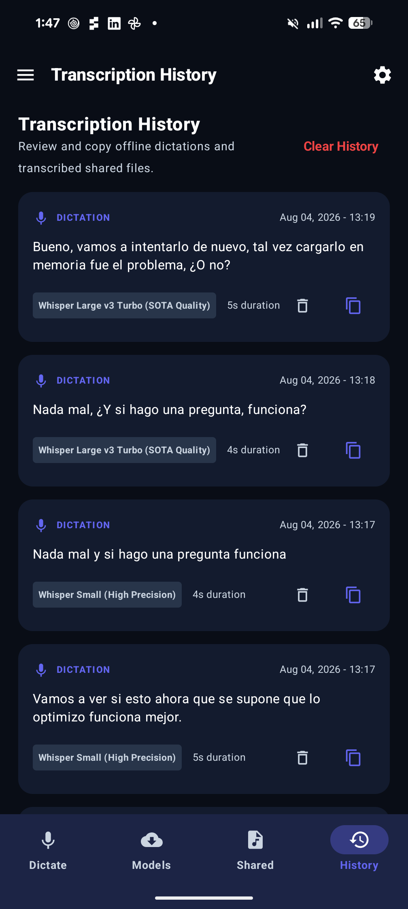
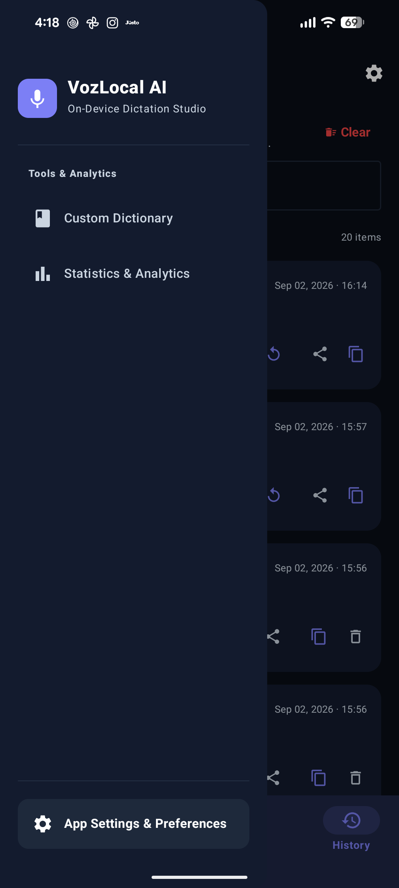
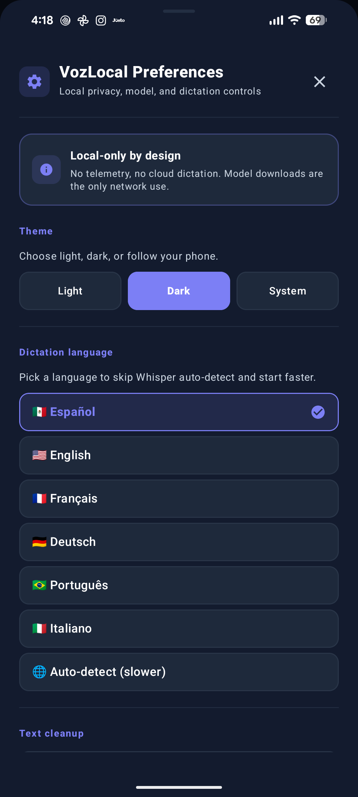

# VozLocal 🎙️⚡

**100% On-Device Local Speech Dictation & Audio Transcription for Android**

[](https://developer.android.com)
[](https://kotlinlang.org)
[](https://developer.android.com/jetpack/compose)
[](https://github.com/ggerganov/whisper.cpp)
[](#architecture--tech-stack)
[](#privacy--security)
[](PRIVACY_POLICY.md)

**VozLocal** is a privacy-first, ultra-fast Android application for local speech-to-text dictation and audio file transcription. It runs on-device using quantized OpenAI Whisper GGUF/bin models via `whisper.cpp` and local rule-based text cleanup — **no cloud APIs, no telemetry, no third-party SDKs that phone home**. Network access is used only to download model files. A global floating accessibility overlay lets you dictate into any app on the device.

---

## 📱 Application Screenshots

| Live Dictate | Speech Models | Shared Audio File |
| :---: | :---: | :---: |
|  |  |  |

| Transcription History | Navigation Drawer | Settings Sheet |
| :---: | :---: | :---: |
|  |  |  |

---

## ✨ Key Features

- 🎙️ **On-Device Speech Recognition** — Quantized OpenAI Whisper models run locally on Android hardware via JNI C++ bindings (`whisper.cpp`). Hardware-accelerated ARMv8.2-A / ARMv9-A `+dotprod`, `+fp16`, and `+i8mm` (Int8 Matrix Multiplication) instruction sets deliver ~2–4x faster matrix decoding. Zero cloud APIs or external servers.
- ⚡ **Dynamic Audio Context & Focus Warmup** — Dynamic `audio_ctx` scaling adapts the encoder window to utterance duration (eliminating 2.5x–4x redundant processing on short dictations), while input-focused background pre-warming keeps native models hot in RAM for instantaneous dictation response.
- 🎈 **Global Floating Dictation Button** — Accessibility Service + `WindowManager` overlay places an elegant floating microphone button right alongside your traditional keyboard (Gboard, Samsung, SwiftKey). Features persistent screen positioning across reboots, automatic smooth edge-docking animation, and tactile haptic feedback.
- 🛡️ **Play Store & Bank Protection** — Configured as an authorized Android Accessibility Tool (`android:isAccessibilityTool="true"`). Built-in sensitive app denylist automatically hides the floating button in banking apps, password managers, and authenticators. Includes in-app privacy policy & offline guarantee dialog.
- 📁 **Shared Audio File & History Export** — Receives shared voice notes/recordings via Android `SEND` intents, and provides one-tap export of your complete transcription archive to Markdown/Text via the Android Sharesheet.
- 🗣️ **Intelligent Spoken Punctuation** — Converts vocalized punctuation commands in Spanish and English (e.g., *"punto", "coma", "abrir/cerrar interrogación", "nueva línea", "nuevo párrafo"*) with clean forward/backward symbol attachment.
- 🧹 **Local Text Cleanup Modes** — Pure-Kotlin rule-based engine strips safe filler vocalizations ("um", "uh", "euh", "ähm"…), collapses repeated tokens, and applies capitalization/punctuation. Minimal, Balanced (default), and Aggressive modes.
- 🎨 **Adaptive Material 3 UI & Semantic Contrast** — Full Light and Dark theme support adhering to WCAG AAA contrast guidelines, `AnimatedContent` tab transitions, dynamic audio waveform visualizer, spring-scale micro-interactions, and live transcription canvas.

---

## 🛠️ Architecture & Tech Stack

```
VozLocal System Architecture (v2)
┌──────────────────────────────────────────────────────────────────────────┐
│                  Jetpack Compose UI (MVVM, Material 3)                    │
│ ┌──────────────┐ ┌──────────────┐ ┌──────────────┐ ┌──────────────────┐  │
│ │  DictateTab  │ │  ModelsTab   │ │ SharedTab    │ │ HistoryTab /     │  │
│ │  (filters)   │ │  (paged)     │ │ (decode UI)  │ │ Dictionary/Stats │  │
│ └──────────────┘ └──────────────┘ └──────────────┘ └──────────────────┘  │
│  ↑                                                                       │
│  │  StateFlow / collectAsStateWithLifecycle                              │
│  │                                                                       │
│ ┌─────────────────────▼────────────────────────────────────────────────┐ │
│ │                       MainViewModel                                    │ │
│ │  - StateFlow<Model/History/Dictionary/Stats>                           │ │
│ │  - In-memory ring buffer for live waveform                             │ │
│ │  - downloadProgressFor(modelId): StateFlow<Float>                      │ │
│ │  - onCleared() stops only a ViewModel-owned recording session           │ │
│ └───────┬──────────────────────────────┬──────────────────────┬─────────┘ │
└─────────┼──────────────────────────────┼──────────────────────┼───────────┘
          │                              │                      │
┌─────────▼──────────┐  ┌────────────────▼──────────┐  ┌───────▼──────────────────┐
│  AudioRecorder     │  │  DictationRepository      │  │  DictationAccessibility   │
│  (process-wide     │  │  - WhisperEngine (load)   │  │  Service                  │
│   singleton,       │  │  - AudioDecoder (decode)  │  │  - Floating overlay       │
│  synchronized(this)│  │  - TextPolishEngine       │  │  - Text injection         │
│  - Room (DAO) + Prefs     │  │  - Same singleton         │
└─────────┬──────────┘  │  - postProcessText()      │  │    recorder               │
          │             └────────────┬─────────────┘  └────────────┬──────────────┘
          │                          │                              │
┌─────────▼──────────────────────────▼──────────────────────────────▼─────────┐
│                   WhisperEngine (com.whispercpp.whisper.WhisperContext)      │
│                  - Single-thread executor (JNI constraint)                   │
│                  - WhisperLib.fullTranscribeWithParams() — language hint,    │
│                    dynamic audio_ctx, temperature fallback, and noTimestamps │
│                  - adaptive thread count with Tensor G3 & 8+ core optimization│
│                  - Cleaner-based backstop cleanup (no finalize()/runBlocking)│
└──────────────────────────────────┬──────────────────────────────────────────┘
                                   │
┌──────────────────────────────────▼──────────────────────────────────────────┐
│                    On-Device Local Models                                    │
│   ggml-tiny / base / small / medium / large-v3-turbo.bin (q8_0 / q5_0)      │
└─────────────────────────────────────────────────────────────────────────────┘
```

### Application / Process Lifecycle

`VozLocalApp : Application` is the single source of truth for shared singletons:

| Field | Type | Notes |
|---|---|---|
| `repository` | `DictationRepository` | Lazy-initialized; owns the `WhisperEngine`, `ModelDownloader`, `AudioDecoder`, `TextPolishEngine`, and Room database. |
| `audioRecorder` | `AudioRecorder` | Process-wide singleton. Both `MainViewModel` and `DictationAccessibilityService` read this same instance; state transitions are guarded by `synchronized(this)` and the IO reader thread reads `@Volatile` fields, so the two can never open `AudioRecord` on the same mic. |
| `applicationScope` | `CoroutineScope` | `SupervisorJob() + Dispatchers.IO`. Owns the long-lived `repository.initializeModels()` call (seed default model rows, prune stale ones, refresh download state). |

`MainViewModel.onCleared()` stops only a recording session that the ViewModel actually owns. The process-wide recorder is not released by Activity destruction, so it cannot interrupt a simultaneous accessibility-overlay dictation. The repository still exposes `shutdown()` for app-level teardown of the native `WhisperContext`.

### Layered View → Service → Repository → Engine

```
Compose Screen
  └─ collectAsStateWithLifecycle() over ViewModel StateFlow
       └─ MainViewModel exposes state, mutators, and in-memory caches
            └─ DictationRepository (single orchestration layer)
                 ├─ WhisperEngine     (JNI bridge to whisper.cpp)
                 ├─ AudioDecoder      (MediaCodec + PCM resample)
                 ├─ ModelDownloader   (OkHttp + SHA-256 verify)
                 ├─ TextPolishEngine  (rule-based cleanup & Spanish accent normalization)
                 └─ Room DAOs         (model / history / dictionary / stats)
```

### Service ↔ ViewModel Coordination

`DictationAccessibilityService` does **not** re-implement recording or transcription. It:
1. Borrows the same `AudioRecorder` singleton from `VozLocalApp`.
2. Uses its own `serviceScope` for floating-overlay-only work.
3. Queries `repository.allModels.first()` and `repository.postProcessText(...)` with the persisted cleanup settings to share the canonical post-processing pipeline with the in-app ViewModel.

A `SharedPreferences.OnSharedPreferenceChangeListener` is registered in the service for `show_only_on_input` so overlay visibility updates instantly when the user toggles the setting in the app.

---

| Layer | Technology |
|---|---|
| **Language** | Kotlin 2.2.10 & C++ (JNI, vendored whisper.cpp) |
| **UI Framework** | Jetpack Compose (Material 3, BOM 2024.09.00) |
| **Architecture** | MVVM, Kotlin Coroutines, `StateFlow`, process-scoped singletons |
| **STT Engine** | `whisper.cpp` (q8_0 / q5_1 GGML quantized with ARMv8.2-A / ARMv9-A `+dotprod` and `+i8mm` hardware acceleration, adaptive multi-core threading) |
| **Text Cleanup** | Local rule-based Kotlin engine (`TextPolishEngine`) — Minimal / Balanced / Aggressive modes, Spanish orthography normalization, pure Kotlin, zero latency |
| **Persistence** | Room 2.7.0 (version 2, with stub `MIGRATION_1_2`, no destructive fallback) |
| **Audio Capture** | `AudioRecord` API (16 kHz mono PCM, `VOICE_RECOGNITION` source) |
| **Audio Decoding** | `MediaCodec` + `MediaExtractor`; drains output EOS, handles decoder PCM format changes, downmixes channels, and resamples to 16 kHz |
| **Networking** | OkHttp 4.x (model downloads only; offline thereafter) |
| **Global Overlay** | Android `AccessibilityService` + `WindowManager` (edge docking, position persistence, haptic feedback, display-cutout aware) |
| **Build** | AGP 9.3.1, R8 minify + resource shrink **enabled** for release |

---

## 📦 Supported Local Speech Models

Models are downloaded on-demand from Hugging Face directly to `context.filesDir/models` and run offline:

| Model ID | Weight File | Size (MB) | Spanish Accuracy | Decoding Speed | Recommended For |
|---|---|---|---|---|---|
| `whisper_base` *(Recommended Default)* | `ggml-base-q8_0.bin` | ~78 MB | 83% | **5.0x** | Optimal balance of speed, accuracy, and memory for mobile |
| `whisper_tiny` | `ggml-tiny-q8_0.bin` | ~42 MB | 72% | **8.5x** | Ultra-fast dictation on low-end hardware |
| `whisper_base_en` | `ggml-base.en-q8_0.bin` | ~78 MB | — (English: 93%) | **5.5x** | Dedicated high-speed English model |
| `whisper_small` | `ggml-small-q8_0.bin` | ~252 MB | 92% | **2.5x** | High accuracy dictation & clean audio notes |
| `whisper_small_q5_1` | `ggml-small-q5_1.bin` | ~175 MB | 91% | **3.2x** | Mobile sweet spot: high accuracy with lower memory footprint |
| `whisper_large_v3_turbo` | `ggml-large-v3-turbo-q5_0.bin` | ~547 MB | 99% | **3.5x** | SOTA quality transcription, faster than medium |
| `whisper_medium` | `ggml-medium-q8_0.bin` | ~823 MB | 97% | **1.0x** | Complex vocab, accents & technical dictation (legacy heavy) |


> **Model integrity**: downloads are written to unique `.part` files, checked for complete transport length and model-specific minimum size, and then atomically moved into place. SHA-256 verification is supported when a real hash is pinned, but the current Hugging Face URLs do not yet have pinned immutable hashes in this repo, so downloads are explicitly marked unverified instead of pretending placeholder hashes are real. Pin immutable model revisions and real SHA-256 values before shipping.

---

## ⚖️ Accuracy & Performance

VozLocal optimizes for complete, accurate local transcription before micro-latency:

- **Multi-core CPU threading optimization** — `WhisperCpuConfig` dynamically discovers high-performance CPU cores by parsing `/sys/devices/system/cpu/` and `/proc/cpuinfo`. It safely allocates up to 5 performance cores on modern 8+ core and 9-core mobile SoCs (such as the Pixel 8 Pro Tensor G3: 1x Cortex-X3 + 4x Cortex-A715) while reserving CPU budget for audio recording and UI threads. Thread allocation also scales by active model size, with configurable JVM override (`-Dvozlocal.whisper.threads=N`).
- **Native ARM `FEAT_I8MM` acceleration** — Compiling with `-march=armv8.2-a+fp16+dotprod+i8mm` unlocks hardware-accelerated Int8 Matrix Multiplication (`SMMLA`/`UMMLA`) and GGML KleidiAI kernels, providing up to 2x faster matrix evaluation on quantized models (`whisper_base` Q8_0 and `whisper_small_q5_1`).
- **Input-focus zero-latency model warmup & GGML graph pre-warming** — In `DictationAccessibilityService`, whenever a permitted text input field receives focus (`TYPE_VIEW_FOCUSED` or `TYPE_WINDOW_STATE_CHANGED`), a background coroutine warms up the active Whisper model in memory (`warmupModelIfNeeded()`). In `WhisperEngine`, model loading executes a background dry-run inference pass (200ms dummy audio) to pre-allocate GGML memory arenas and fault kernel code pages ahead of time, eliminating first-run allocation pauses (~300–600ms).
- **Smart `onTrimMemory` keep-alive & eviction policy** — `VozLocalApp` monitors Android system memory pressure (`ComponentCallbacks2.onTrimMemory`). Under moderate pressure, the native model remains permanently pinned in RAM; under critical system memory emergencies (`TRIM_MEMORY_COMPLETE`), idle models are gracefully unloaded to protect the accessibility service from being killed, automatically reloading and pre-warming as soon as an input field is focused.
- **Robust timestamp-guided segmentation** — Live dictation retains standard Whisper timestamp tokens (`noTimestamps = false`) across the full 30-second context window. This ensures long dictations (>8s) are seamlessly decoded across segment boundaries without cutting off speech, while multi-temperature fallback (`temperatureInc = 0.2f`) automatically breaks out of repetition loops.
- **Hallucination & loop collapse post-filtering** — `HallucinationFilter` automatically detects and collapses pathological word loops ("no no no...") and multi-word phrase loops ("ustedes como ven...") before text is committed.
- **Long-file coherence** — Shared audio uses timestamps, multi-window decoding, and previous decoder context rather than treating every Whisper window as unrelated speech.
- **Measurable comparisons** — The `benchmark` package provides deterministic Unicode-aware WER/CER scoring and records model, quantization, threads, VAD, timing, real-time factor, optional memory, and thermal status. Model labels in the UI and table are guidance, not device-specific measurements.

### Pixel 8 Pro baseline

For accuracy-first use, benchmark `large-v3-turbo q5_0` against `small q8_0` on representative recordings before choosing a default. Test 3–6 threads, cold and warm starts, and sustained 10-minute sessions; select the configuration with the best WER/CER that remains comfortably faster than real time without thermal throttling. The app supplies benchmark foundations, but does not yet ship a benchmark UI or hard-code unverified Pixel measurements.

---

## 🚀 Getting Started

### Prerequisites

- **Android Studio**: Ladybug (2024.2.1+) or newer
- **JDK**: Version 17+
- **Android SDK**: Minimum SDK 26 (Android 8.0 Oreo), Target SDK 36
- **NDK**: Android NDK r25c or higher for compiling the vendored `whisper.cpp` C++ JNI

### Installation & Build

```bash
git clone https://github.com/lander16/voz-local.git
cd voz-local
cp .env.example .env          # optional, only if you override build config
./gradlew assembleDebug
./gradlew installDebug
```

Release builds enable R8 minification + resource shrinking. The `proguard-rules.pro` keeps the JNI bridge, Room entities/DAOs, the `AccessibilityService`, and the Compose runtime intact.

---

## 📱 How to Use

### 1. Initial Permissions Setup
On first launch you'll see a 2-step setup wizard:
1. **Microphone Permission** — required for live dictation
2. **Accessibility Service** — required for the global floating overlay

A "Skip Setup & Explore App" option is provided; if you skip, a persistent banner offers to grant the missing permission later.

### 2. Live Voice Dictation
1. Open the **Dictate** tab.
2. (Optional) Pick a language (Spanish, English, etc.) — explicit language skips Whisper's auto-detect overhead.
3. Tap the large circular microphone to start. The pulse aura, live waveform, and timer will all light up.
4. Tap the mic (or the stop icon) to finish. The transcript is auto-saved locally and can be copied or shared from the app.

### 3. Using the Global Floating Assistant
1. Enable **VozLocal Floating Dictation** in Android's *Accessibility Settings*.
2. In **Settings → Floating assistant**, add banks, password managers, authenticators, and payment apps to **Protect sensitive apps**.
3. Open a permitted app (WhatsApp, Gmail, Chrome, Notes).
4. Tap on a text field — the floating mic icon appears (it stays hidden when no field is focused).
5. Tap the floating mic to dictate; text is inserted only with direct `ACTION_SET_TEXT` into the original permitted app/window. If the target changes or rejects insertion, the transcript stays local in history.

### 4. Transcribing Shared Audio Files
1. In WhatsApp, Voice Memos, or Files, tap **Share** on any audio file (`.wav`, `.mp3`, `.m4a`, `.ogg`).
2. Pick **VozLocal** — the **Shared** tab opens with the file loaded.
3. Tap **Start offline transcription**. Progress is reported through decode → model-load → inference → post-process stages.

### 5. Managing Models & Custom Dictionary
- **Models** tab — download or activate Whisper models. Download progress is now driven by an in-memory flow (not a per-1% Room write) so the list doesn't recompose 100 times during an 800 MB download.
- **Dictionary** tab — add custom brand names or technical terms. Compiled regexes are cached and invalidated on insert/delete.

### 6. Settings
- **Appearance** — Light, Dark, or System. ("System" follows the OS setting via `isSystemInDarkTheme()` inside `MyApplicationTheme`.)
- **Language** — the same set as in the Dictate tab.
- **Post-processing** — Smart pause correction, auto-capitalization, dictionary, local cleanup mode (Minimal / Balanced / Aggressive), spoken punctuation commands, and optional VAD. The VAD model downloads only when you explicitly request it. These settings are persisted to SharedPreferences.
- **Overlay** — show the floating button only on text fields and select sensitive apps where it must never appear.
- **History & Data Management** — opt-out of saving transcripts, cap history limit, or one-tap export your entire transcription history to Markdown/Text via the Android sharesheet.
- **Privacy & Security** — view the in-app "Privacy Policy & Offline Guarantee" modal dialog confirming zero cloud telemetry and local model execution.
- **Done** — closes the sheet (settings are saved instantly on toggle).

---

## 🎈 Floating Microphone Gestures

The floating accessibility overlay provides fluid, non-intrusive dictation alongside any Android keyboard:

- **Tap to start / stop** — Tap the microphone to immediately begin dictation with instant tactile haptic feedback. A second tap stops recording and inserts your transcription into the active text field.
- **Drag anywhere on screen to reposition** — Freely drag the floating button to any location on your screen with real-time responsive touch tracking.
- **Automatic edge-docking** — When released, a smooth spring deceleration animation snaps the button flush against the left or right screen bezel (whichever is closest), ensuring underlying reading material and keyboard layouts stay unobscured while respecting display cutouts and navigation bars.
- **Persistent positioning** — Remembers your customized placement across app restarts and system reboots via `FloatingButtonDockPolicy` and device-local preferences.

---

## 🗣️ Spoken Punctuation Commands Cheat Sheet

VozLocal features phrase-isolated spoken punctuation replacement. When **Spoken punctuation commands** is enabled in Settings, vocalized punctuation commands are converted into natural punctuation marks and line breaks. Because the replacement rules isolate punctuation commands, ordinary phrases (such as *"el paciente entró en coma"* or *"the word period is a noun"*) are preserved without unwanted substitution.

### 🇪🇸 Spanish Commands

| Spoken Command | Output Symbol | Behavior / Meaning |
|---|:---:|---|
| `punto` / `punto final` / `punto y seguido` / `punto y aparte` | `.` | Period followed by a space and automatic sentence capitalization |
| `coma` | `,` | Comma followed by a space |
| `punto y coma` | `;` | Semicolon followed by a space |
| `dos puntos` | `:` | Colon followed by a space |
| `puntos suspensivos` | `...` | Ellipsis |
| `abrir interrogación` / `abrir signo de interrogación` | `¿` | Inverted Spanish question mark attaching to following text |
| `cerrar interrogación` / `cerrar signo de interrogación` / `signo de interrogación` | `?` | Closing question mark with trailing space |
| `abrir exclamación` / `abrir signo de admiración` | `¡` | Inverted Spanish exclamation mark attaching to following text |
| `cerrar exclamación` / `cerrar signo de admiración` / `signo de exclamación` | `!` | Closing exclamation point with trailing space |
| `abrir comillas` | `"` | Opening quotation mark |
| `cerrar comillas` | `"` | Closing quotation mark |
| `abrir paréntesis` | `(` | Opening parenthesis attaching to following word |
| `cerrar paréntesis` | `)` | Closing parenthesis |
| `nueva línea` | `\n` | Single line break |
| `nuevo párrafo` | `\n\n` | Double line break starting a new paragraph |
| `guión` | `-` | Dash / hyphen |

### 🇬🇧 English Commands

| Spoken Command | Output Symbol | Behavior / Meaning |
|---|:---:|---|
| `period` / `full stop` | `.` | Period followed by space and capitalizes next word |
| `comma` | `,` | Comma followed by space |
| `semicolon` | `;` | Semicolon followed by space |
| `colon` | `:` | Colon followed by space |
| `ellipsis` / `dot dot dot` | `...` | Ellipsis |
| `question mark` | `?` | Question mark with trailing space |
| `exclamation mark` / `exclamation point` | `!` | Exclamation point with trailing space |
| `open quote` / `open quotation mark` | `"` | Opening quotation mark |
| `close quote` / `close quotation mark` | `"` | Closing quotation mark |
| `open parenthesis` / `open paren` | `(` | Opening parenthesis |
| `close parenthesis` / `close paren` | `)` | Closing parenthesis |
| `new line` | `\n` | Single line break |
| `new paragraph` | `\n\n` | Double line break starting a new paragraph |
| `hyphen` / `dash` | `-` | Dash / hyphen |

---

## 🔒 Privacy, Security & Google Play Compliance

> 📄 **Official Public Privacy Policy:** The complete legal privacy document complying with Google Play's User Data policy is published at [**PRIVACY_POLICY.md**](PRIVACY_POLICY.md) (provided in English and Spanish). You can submit this URL directly in Google Play Console: `https://github.com/lander16/voz-local/blob/main/PRIVACY_POLICY.md`

VozLocal is architected from inception for complete local sovereignty, zero cloud tracking, and strict adherence to Google Play Store policies:

### 1. 100% On-Device Offline Guarantee
- **Zero telemetry or external analytics**: No Firebase, telemetry trackers, crash-loggers, or third-party SDKs are embedded.
- **Air-gapped voice transcription**: All Whisper speech recognition models run purely on-device using local CPU inference (`whisper.cpp`). No audio recordings, audio samples, or generated transcripts are ever transmitted to remote servers.
- **Air-gapped operation**: Turn on Airplane Mode after downloading a speech model and VozLocal will operate indefinitely at 100% functionality. Network access is utilized exclusively for user-initiated model weight downloads.

### 2. Google Play Accessibility Tool Compliance (`isAccessibilityTool="true"`)
- **Official Assistive Purpose**: In Android 14+ (API 34), RASP security engines in sensitive applications flag generic accessibility services. VozLocal explicitly declares `android:isAccessibilityTool="true"` in its `accessibility_service_config.xml` to signify compliance with Google Play's Accessibility API policies.
- **Accessibility Beneficiaries**: VozLocal serves as an assistive voice-typing alternative for individuals with motor disabilities, repetitive strain injuries (RSI), tremors, visual impairments, or situational typing constraints.
- **Strict Scope of Operation**:
  - The accessibility service only observes focus and window transitions (`TYPE_VIEW_FOCUSED`, `TYPE_WINDOW_STATE_CHANGED`) to position the floating microphone alongside the active keyboard.
  - It does **not** read screen contents or text from other applications, does not log keystrokes, does not capture screenshots, and does not inspect window node hierarchies.
  - Text insertion occurs solely via Android's `ACTION_SET_TEXT` API when the user explicitly triggers dictation.

### 3. Sensitive & Banking Application Protection
- **Automatic Denylist Shielding**: VozLocal incorporates a dedicated sensitive application exclusion manager in **Settings → Floating assistant**.
- **Password & Financial Safety**: The floating button is automatically hidden and all text operations are rejected when interacting with banking applications, cryptocurrency wallets, password managers, or secure password/PIN input fields.
- **Private Local Storage**: Transcripts and custom dictionaries reside exclusively in the device's private Room database (`vozlocal_database`), explicitly excluded from cloud backups and device migration (`backup_rules.xml`).

### 4. Android Permission Justifications

| Permission | Justification & Usage Scope |
|---|---|
| `android.permission.RECORD_AUDIO` | **Dictation capture**: Used exclusively while an active speech recording session is initiated by the user. The microphone is never accessed in the background or when dictation is stopped. Audio is processed directly in-memory into 16 kHz PCM frames without leaving device RAM. |
| `android.permission.BIND_ACCESSIBILITY_SERVICE` | **Assistive overlay & text entry**: Used solely to detect when an editable text view is focused so the floating microphone button can be presented, and to insert the generated transcription directly into the active field via `ACTION_SET_TEXT`. |
| `android.permission.SYSTEM_ALERT_WINDOW` | **Floating overlay presentation**: Required to display the floating microphone button and wave aura over permitted apps alongside the soft keyboard. |
| `android.permission.INTERNET` | **Model downloads only**: Utilized exclusively for user-directed downloads of quantized Whisper model weights from Hugging Face. Never invoked during recording or transcription. |

---

## 🧱 Recent Architectural Changes (v2)

| Area | Before | After |
|---|---|---|
| `AudioRecorder` | Two instances (ViewModel + Service), raced for the mic | Process-wide singleton in `VozLocalApp`; state transitions guarded by `synchronized(this)` and the IO reader thread reads `@Volatile` fields |
| `WhisperContext` cleanup | `runBlocking` on the GC finalizer thread | `Cleaner`-based backstop + lifecycle mutex that serializes load / transcribe / release |
| CPU thread count | Re-read `/proc/cpuinfo` on every transcription | Adaptive lazy selection with `-Dvozlocal.whisper.threads=N` override; optimized for Tensor G3 (Pixel 8 Pro) and modern 8+ core chips to map 5 threads across high-performance cores |
| Native hardware acceleration | Basic ARMv8.2-A `+dotprod` | Upgraded compiler flags to `-march=armv8.2-a+fp16+dotprod+i8mm` for `whisper_v8fp16_va`, activating KleidiAI hardware Int8 matrix multiplication (`SMMLA`/`UMMLA`) |
| Dynamic audio context | Fixed 30.0s context window (`audio_ctx = 1500`, 3000 mel frames) | Dynamic `audio_ctx` scaling (`((durationSec + 0.75f) * 50).coerceIn(256, 1500)`) cuts 2.5x–4x redundant encoder computation for short dictations |
| Floating button ergonomics | Free-floating without memory or haptics | SharedPreferences position memory across reboots, 180ms smooth edge-docking animation to nearest bezel, and tactile click haptic feedback |
| Spoken punctuation engine | Basic keyword matching with replacement bugs | Comprehensive Spanish and English punctuation command dictionary with forward/backward symbol attachment and clean line break handling |
| Theme & Contrast | Hardcoded dark colors caused low contrast in Light mode | App-wide semantic Material 3 theming (`onSurface`, `surface`, `onPrimary`, etc.), WCAG AAA compliant contrast, and reactive `MainActivity` `themeMode` binding |
| In-app dictation & rendering | Mic hijacked by download guard; text collapsed to 0 height | Unconditional recording toggle, dynamic model fallback resolution, and fixed zero-height layout bug in Live Transcription Card |
| Compliance & Data Export | No in-app policy disclosure; no bulk export | Interactive in-app Privacy Policy & Offline Guarantee modal dialog; one-tap Markdown/Text transcription history export via Android sharesheet |
| Smart-punctuation | Two implementations, one dead | Kotlin `postProcessText` is the single source of truth; the JNI pause-joiner is removed |
| Dictionary regexes | Re-compiled every transcription | Hash-keyed cache, invalidated on insert/delete |
| Download progress | Wrote Room on every 1% (100 writes for an 800 MB model) | In-memory `MutableStateFlow<Map<String,Float>>`; DB written only on completion/failure |
| Model downloads | Direct writes to final path + placeholder SHA strings | Unique `.part` files, complete-length/size validation, atomic move, explicit unverified state until real SHA-256 hashes are pinned |
| Silero VAD download | Broken upstream URL / oversized validation floor | Downloads from `ggml-org/whisper-vad`, accepts the current ~0.9 MB asset, and keeps VAD optional/user-toggleable |
| History list | Full table re-emit on every insert | `LIMIT 200` paged flow for the UI; full table retained for stats |
| Filter toggles | Reset on every app restart | Persisted to SharedPreferences via proper setters |
| Cleanup modes | One optional cleanup toggle | Persisted Minimal / Balanced / Aggressive modes exposed in ViewModel and Settings; Dictate tab shows the current mode |
| `postProcessText` signature | Fixed booleans | Cleanup mode and spoken punctuation settings flow through the shared repository pipeline used by the app and overlay |
| Database schema | `fallbackToDestructiveMigration(dropAllTables = true)` | `addMigrations(MIGRATION_1_2)`, no destructive fallback; version bumped to 2 |
| Accessibility service | `typeAllMask` + key-filter | Focus/window-state events only; no interactive-window retrieval; local sensitive-app denylist is checked before source access; password/sensitive nodes and stale targets are rejected |
| Backup rules | Empty TODOs → default behavior leaked 1.5 GB models to cloud | `models/` + database explicitly excluded |
| Build | `isMinifyEnabled = false`, no ProGuard rules | `isMinifyEnabled = true`, `isShrinkResources = true`, explicit keep rules for JNI/Room/AccessibilityService |
| Dependencies | Firebase BOM, Retrofit, Moshi, logging-interceptor (all unused) | Removed; only Compose, Lifecycle, Room, Coroutines, OkHttp, Accompanist, Robolectric/Roborazzi |
| `minSdk` / `targetSdk` | 24 / 36 (unreleased) | 26 / 36 (with a comment to pin to 35 once AGP 9.3.1 is verified on 35) |
| `compileSdk` | `release(36) { minorApiLevel = 1 }` | Same (SDK 36 still tracked) |
| `WhisperEngine` | Hardcoded `language="en"`, no VAD, no initial_prompt, no threshold tuning, single_segment=false | Project-owned JNI shim exposes language, initial_prompt, single_segment, no_speech_thold / logprob_thold / entropy_thold, beam_size, temperature fallback, decoder context, dynamic audio_ctx, and optional Silero VAD. |
| Verification coverage | Sparse post-processing coverage | 105 automated unit & Robolectric tests covering cleanup modes, thread allocation, dynamic context scaling, spoken punctuation, card layout, and VAD integrity |

---

## 🛣️ Roadmap

**Deferred from the current STT correctness and measurement pass:**

- [ ] **[J] GPU / Vulkan / OpenCL delegate on Android** — vendored whisper.cpp is CPU-only. Switching to GPU would require forking the build, adding `GGML_VULKAN=ON` / `GGML_OPENCL=ON` to the project-owned CMakeLists, and shipping per-driver fallbacks.
- [ ] **Audio resampling quality** — replace the current linear resampler with a streaming band-limited/windowed-sinc resampler before 16 kHz Whisper inference; select the cleanest stereo channel rather than always averaging channels.
- [ ] **Pixel calibration UI** — run the benchmark matrix for model, quantization, thread count, VAD, audio source, and decoding profile; persist the best sustainable configuration per device.

**Open items:**

- [ ] **Foreground service for background recording** — add a `<service android:foregroundServiceType="microphone">` so the mic can stay open when the user navigates away mid-dictation. Re-add the `FOREGROUND_SERVICE_MICROPHONE` permission at the same time.
- [ ] **Real SHA-256 hashes and immutable model revisions** for the 5 Whisper model download map entries.
- [ ] **Window-size-class adaptive UI** — `NavigationRail` for width ≥ 600 dp, foldable support.
- [ ] **Room migrations for v2** — the v1 → v2 migration is a no-op stub; the next schema change will add a real `Migration(2, 3)`.
- [x] **`MainActivity` reads `themeMode` from `VozLocalApp.repository`** and passes it to the top-level `MyApplicationTheme`.
- [ ] **Detekt + ktlint + CI** for static analysis.
- [x] **Automated Compose tests** for layout, transcription rendering, CPU configuration, and spoken punctuation.

## 📄 License & Acknowledgments

- **whisper.cpp** — Georgi Gerganov's [`whisper.cpp`](https://github.com/ggerganov/whisper.cpp) C++ library (MIT).
- **OpenAI Whisper** — the original Whisper model weights (MIT).
- **License** — MIT. See [LICENSE](LICENSE).
